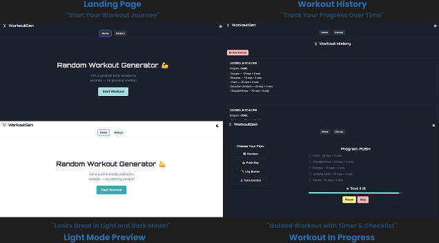

# 🏋️ WorkoutGen

[](https://workoutgen.vercel.app)
[](LICENSE)


A fun and interactive **Random Workout Generator** built with **React + Chakra UI**. Choose your workout flow, get randomized exercises, follow timers, rest between sets, and track your workout history. Perfect for fitness lovers who want quick inspiration on-the-go!

---

## ✨ Features

- 🎲 Random workout generation
- ⏱️ Countdown timers (Work + Rest)
- ✅ Checklist for each done workout
- 💾 Save progress using localStorage
- 🌘 Dark/Light mode support
- 📱 Responsive layout (Mobile-first)
- 🕓 History with timestamps
- 🔁 Restart workout flow anytime

---

## 🖼 Preview



---

## 🚀 Getting Started

### 📦 Installation

```bash
npm install
npm run dev

```

## 📁 Project Structure

<pre> ```text public/ # Static files (e.g. favicon, index.html) src/ ├── components/ # All reusable UI & logic components ├── data/ # Exercise and program data ├── utils/ # Helper functions (e.g., shuffleArray) ├── theme.ts # Custom Chakra UI theme configuration ├── App.tsx # Routing and layout logic ├── main.tsx # App entry point ``` </pre>


## 👨‍💻 Author

Hendra Siswanto

🔗 GitHub: https://github.com/HendraSiswanto

## 📄 License

This project is licensed under the [MIT License](LICENSE).

